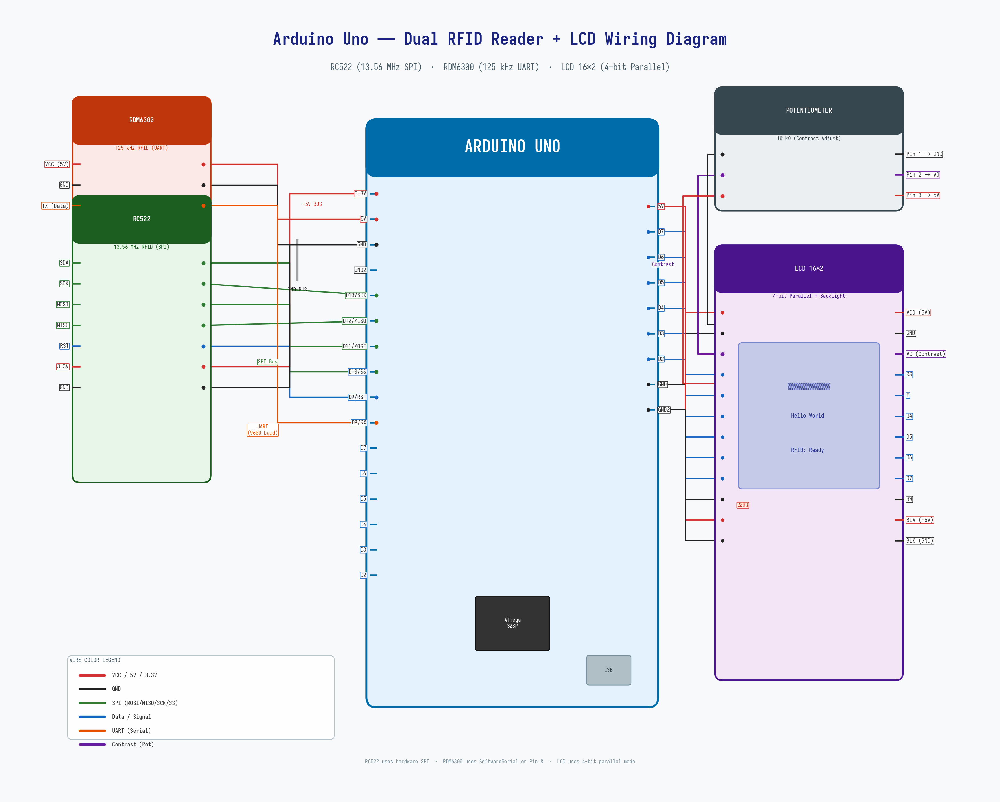

# Arduino RFID Card Type Detector

Устройство на базе Arduino Uno для определения типа поднесённой RFID-карты/брелока и отображения информации о возможности её чтения и клонирования на LCD-дисплее 16×2.



## Возможности

- Автоматическое определение типа RFID-карты по SAK и ATQA
- Поддержка двух частот:
  - **13,56 МГц** (RC522) — MIFARE Classic/Mini/Ultralight/DESFire, NTAG
  - **125 кГц** (RDM6300) — EM4100, HID Prox
- Отображение на LCD 16×2: тип карты, UID, статус чтения и клонирования
- Детальный вывод в Serial (115200 бод) для отладки

## Определяемые типы карт

| Тип | Частота | Чтение | Клонирование | Примечание |
|-----|---------|--------|-------------|------------|
| MIFARE Classic 1K | 13,56 МГц | Полное | Да (FUID) | Стандартные ключи доступа |
| MIFARE Classic 4K | 13,56 МГц | Полное | Да (FUID) | Увеличенная память |
| MIFARE Mini | 13,56 МГц | Полное | Да (FUID) | Компактная версия |
| MIFARE Ultralight | 13,56 МГц | Полное | Да (пустая) | Бесконтактные брелоки |
| MIFARE Ultralight C | 13,56 МГц | Частичное | Нет | AES-шифрование |
| MIFARE DESFire | 13,56 МГц | Ограничено | Нет | Криптографическая защита |
| MIFARE Plus 2/4 | 13,56 МГц | Частичное | Нет | Переходный стандарт |
| NTAG 213/215/216 | 13,56 МГц | Полное | Да (пустая) | NFC-метки |
| ISO 14443-B | 13,56 МГц | Ограничено | Нет | Например, Russian transit |
| EM4100 | 125 кГц | Полное | Да | Домофонные ключи-«капли» |

## Схема подключения

### Компоненты

| Компонент | Описание |
|-----------|----------|
| Arduino Uno | Микроконтроллер |
| RC522 | RFID-считыватель 13,56 МГц (SPI) |
| RDM6300 | RFID-считыватель 125 кГц (UART) |
| LCD 16×2 | Символьный дисплей (4-bit parallel) |
| Потенциометр 10 кОм | Регулировка контраста LCD |
| Резистор 220 Ом | Ограничение тока подсветки LCD |

### Распиновка RC522 → Arduino Uno

| RC522 | Arduino Uno | Назначение |
|-------|-------------|------------|
| SDA | Pin 10 | SPI Slave Select |
| SCK | Pin 13 | SPI Clock |
| MOSI | Pin 11 | SPI Master Out |
| MISO | Pin 12 | SPI Master In |
| RST | Pin 9 | Сброс модуля |
| 3.3V | 3.3V | Питание |
| GND | GND | Общий |

### Распиновка RDM6300 → Arduino Uno

| RDM6300 | Arduino Uno | Назначение |
|---------|-------------|------------|
| TX | Pin 8 | UART-передача (SoftwareSerial RX) |
| VCC | 5V | Питание |
| GND | GND | Общий |

### Распиновка LCD 16×2 → Arduino Uno

| LCD | Arduino Uno | Назначение |
|-----|-------------|------------|
| RS | Pin 7 | Регистр выбора |
| E | Pin 6 | Enable (строб) |
| D4 | Pin 5 | Данные (4-bit) |
| D5 | Pin 4 | Данные (4-bit) |
| D6 | Pin 3 | Данные (4-bit) |
| D7 | Pin 2 | Данные (4-bit) |
| RW | GND | Только запись |
| VDD | 5V | Питание |
| GND | GND | Общий |
| VO | Потенциометр (средний вывод) | Контраст |
| BLA | 5V через 220 Ом | Подсветка + |
| BLK | GND | Подсветка − |

### Потенциометр

| Вывод | Куда подключен |
|-------|---------------|
| 1 | GND |
| 2 (средний) | LCD VO |
| 3 | 5V |

## Использование

### Экраны LCD

При поднесении карты LCD чередует два экрана каждые 2,5 секунды:

```
Экран 1:          Экран 2:
┌────────────────┐ ┌────────────────┐
│ MF Classic 1K  │ │ Read: YES      │
│ UID:A1B2C3D4   │ │ Clone: YES     │
└────────────────┘ └────────────────┘
```

Через 8 секунд после последнего обнаружения карты возвращается экран ожидания:

```
┌────────────────┐
│ Ready...       │
│ Apply card     │
└────────────────┘
```

### Сборка и прошивка

**Зависимости (библиотеки Arduino):**
- MFRC522 — https://github.com/miguelbalboa/rfid
- LiquidCrystal — встроенная (Arduino AVR Core)

**Установка библиотек (arduino-cli):**
```bash
mkdir -p ~/Arduino/libraries
cd ~/Arduino/libraries
git clone https://github.com/miguelbalboa/rfid.git MFRC522
git clone https://github.com/arduino-libraries/LiquidCrystal.git
```

**Компиляция:**
```bash
arduino-cli compile --fqbn arduino:avr:uno rfid_detector.ino
```

**Прошивка:**
```bash
arduino-cli upload -b arduino:avr:uno -p /dev/ttyACM0 -i build/arduino.avr.uno/rfid_detector.ino.hex
```

### Serial-монитор

Подключитесь к Serial на скорости 115200 бод для получения подробной информации о считанных картах:

```
======== Card Detected ========
  Type:  MF Classic 1K
  SAK:   0x08
  ATQA:  0x04 0x00
  UID:   A1 B2 C3 D4
  Read: YES  |  Clone: YES
===============================
```

## Архитектура

```
┌─────────────────────────────────────────────────────┐
│                    Arduino Uno                       │
│                                                      │
│  ┌─────────┐  ┌─────────┐  ┌───────────────────┐   │
│  │  RC522  │  │RDM6300  │  │    LCD 16×2       │   │
│  │ 13,56   │  │ 125     │  │                   │   │
│  │ МГц    │  │ кГц     │  │ Row 0: Тип + UID  │   │
│  │         │  │         │  │ Row 1: R/C статус  │   │
│  │  SPI    │  │  UART   │  │                   │   │
│  │ Pins:   │  │ Pin: 8  │  │ Pins: 2-7 (4-bit) │   │
│  │ 10-13,9 │  │         │  │                   │   │
│  └────┬────┘  └────┬────┘  └────────┬──────────┘   │
│       │            │                │               │
│       └────────────┴────────────────┘               │
│                    loop()                           │
│              ┌──────────────┐                        │
│              │ identifyCard │                        │
│              │ SAK + ATQA   │                        │
│              └──────────────┘                        │
└─────────────────────────────────────────────────────┘
```

## Ограничения

- RC522 не поддерживает карты частотой 125 кГц — для них используется отдельный модуль RDM6300
- Карта, не отвечающая ни на Type A, ни на Type B (13,56 МГц), не будет определена RC522
- Для чтения содержимого секторов MIFARE Classic необходимы ключи доступа (A/B) — в текущей версии не реализовано
- EM4100 определяет только UID (Wiegand26-формат), содержимое не читается

## Лицензия

MIT
