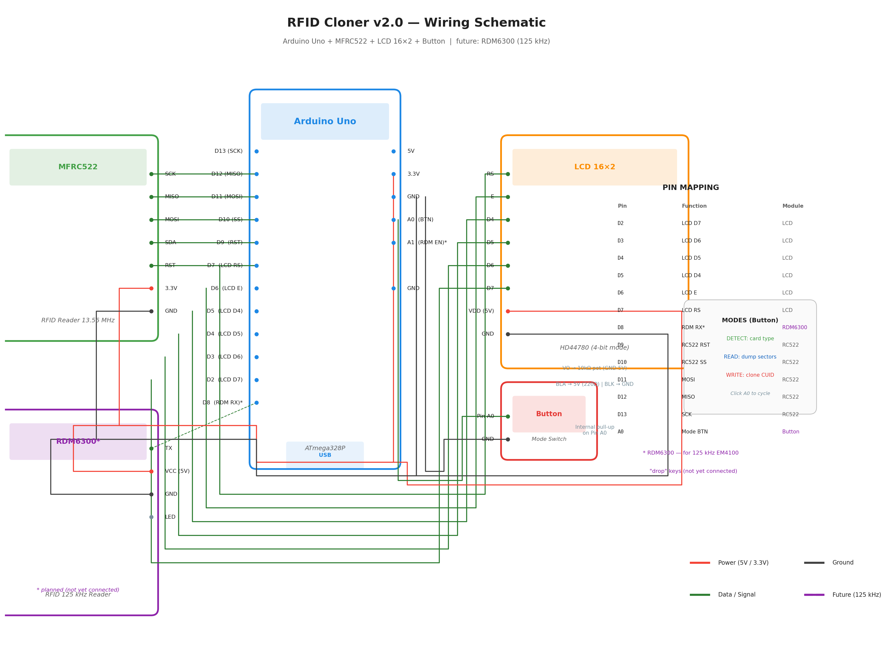

# Arduino RFID Card Cloner

Устройство на базе Arduino Uno для определения типа RFID-карты и клонирования MIFARE Classic на пустые CUID-карты. Поддерживает 3 режима работы: DETECT (определение типа), READ (чтение дампа), WRITE (запись на CUID).



## Возможности

- **Три режима** (переключение одной кнопкой):
  - `DETECT` — определение типа карты по SAK/ATQA, UID, статус чтения и клонирования
  - `READ` — чтение всех секторов MIFARE Classic 1K/4K в память Arduino
  - `WRITE` — запись сохранённого дампа на пустую CUID-карту
- Брутфорс ключей: 10 распространённых ключей доступа (включая фабричный FF..FF)
- Детальный вывод дампа в Serial (115200 бод)
- Автоматическое определение типа: MIFARE Classic 1K/4K, Mini, Ultralight/C, DESFire, Plus, NTAG, ISO 14443-B
- Максимальная мощность антенны (0xFF) для лучшего считывания

## Что нужно для клонирования

### MIFARE Classic 1K (домофонные ключи, такие как Цифрал)

| Компонент | Описание | Где купить |
|-----------|----------|------------|
| CUID-карта | Пустая MIFARE Classic 1K с перезаписываемым UID | AliExpress: «CUID card» или «FUID card», ~$0.5-1/шт |
| RC522 модуль | Уже подключён, он и читает и пишет | — |
| Кнопка | Любая тактовая кнопка на Pin A0 | — |

**Процесс:**
1. Переключите режим в `READ` (нажмите кнопку 1 раз)
2. Поднесите оригинальный ключ Цифрал → Arduino прочитает все 16 секторов
3. Уберите оригинальный ключ
4. Переключите режим в `WRITE` (нажмите кнопку ещё 2 раза)
5. Поднесите пустую CUID-карту → Arduino запишет дамп на CUID
6. Готово! CUID-карта теперь является копией оригинала

### 125 кГц «капля» (EM4100) — будущая поддержка

Для клонирования ключей-«капель» 125 кГц (domofon keys без контактов) нужны дополнительные компоненты:

| Компонент | Описание | Цена |
|-----------|----------|------|
| RDM6300 | Модуль чтения 125 кГц (UART) | ~$1-2 |
| T5577-карта | Перезаписываемая 125 кГц карта | ~$0.3-0.5 |
| 125 кГц writer | Модуль записи на T5577 (RDM6300 только читает) | ~$2-3 |

RC522 физически не способен работать на 125 кГц — это совершенно другой стандарт (индуктивная связь vs. электромагнитное поле). На схеме RDM6300 показан пунктиром как плановое подключение (TX → Pin D8).

## Определяемые типы карт

| Тип | Частота | Чтение | Клонирование | Примечание |
|-----|---------|--------|-------------|------------|
| MIFARE Classic 1K | 13,56 МГц | Полное (все 16 секторов) | Да (CUID) | Домофонные ключи Цифрал |
| MIFARE Classic 4K | 13,56 МГц | Частичное (16 из 40) | Частично (CUID 4K) | 40 секторов не влезают в 2 КБ RAM Arduino |
| MIFARE Mini | 13,56 МГц | Полное (5 секторов) | Да (CUID) | Компактная версия |
| MIFARE Ultralight | 13,56 МГц | Полное | Да (пустая NTAG) | Бесконтактные брелоки |
| MIFARE Ultralight C | 13,56 МГц | Частичное | Нет | AES-шифрование |
| MIFARE DESFire | 13,56 МГц | Ограничено | Нет | Криптографическая защита |
| MIFARE Plus 2/4 | 13,56 МГц | Частичное | Нет | Переходный стандарт |
| NTAG 213/215/216 | 13,56 МГц | Полное | Да (пустая NTAG) | NFC-метки |
| ISO 14443-B | 13,56 МГц | Ограничено | Нет | Карты метро и транспорта |
| EM4100 | 125 кГц | Полное (UID) | Да (T5577) | Домофонные «капли» — нужен RDM6300 |

## Схема подключения


### Компоненты

| Компонент | Описание |
|-----------|----------|
| Arduino Uno | Микроконтроллер (ATmega328P, 2 КБ SRAM, 32 КБ Flash) |
| MFRC522 | RFID-считыватель/писатель 13,56 МГц (SPI) |
| LCD 16×2 | Символьный дисплей HD44780 (4-bit parallel) |
| Тактовая кнопка | Переключение режимов (Pin A0, internal pull-up) |
| Потенциометр 10 кОм | Регулировка контраста LCD |
| Резистор 220 Ом | Ограничение тока подсветки LCD |
| RDM6300 (future) | RFID-считыватель 125 кГц (UART, Pin D8) |

### Распиновка RC522 → Arduino Uno

| RC522 | Arduino Uno | Назначение |
|-------|-------------|------------|
| SDA | Pin 10 | SPI Slave Select |
| SCK | Pin 13 | SPI Clock |
| MOSI | Pin 11 | SPI Master Out |
| MISO | Pin 12 | SPI Master In |
| RST | Pin 9 | Сброс модуля |
| 3.3V | 3.3V | Питание |
| GND | GND | Общий |

### Распиновка LCD 16×2 → Arduino Uno

| LCD | Arduino Uno | Назначение |
|-----|-------------|------------|
| RS | Pin 7 | Регистр выбора |
| E | Pin 6 | Enable (строб) |
| D4 | Pin 5 | Данные (4-bit) |
| D5 | Pin 4 | Данные (4-bit) |
| D6 | Pin 3 | Данные (4-bit) |
| D7 | Pin 2 | Данные (4-bit) |
| RW | GND | Только запись |
| VDD | 5V | Питание |
| GND | GND | Общий |
| VO | Потенциометр (средний вывод) | Контраст |
| BLA | 5V через 220 Ом | Подсветка + |
| BLK | GND | Подсветка − |

### Распиновка кнопки → Arduino Uno

| Кнопка | Arduino Uno | Назначение |
|--------|-------------|------------|
| Pin 1 | Pin A0 | Вход (INPUT_PULLUP) |
| Pin 2 | GND | Замыкание на землю |

### Распиновка RDM6300 → Arduino Uno (future)

| RDM6300 | Arduino Uno | Назначение |
|---------|-------------|------------|
| TX | Pin 8 | UART-приём (SoftwareSerial RX) |
| VCC | 5V | Питание |
| GND | GND | Общий |

### Потенциометр

| Вывод | Куда подключен |
|-------|---------------|
| 1 | GND |
| 2 (средний) | LCD VO |
| 3 | 5V |

## Использование

### Режимы работы

Нажмите кнопку на Pin A0 для переключения режимов:

```
DETECT → READ → WRITE → DETECT → ...
```

### Экраны LCD

**DETECT (режим по умолчанию):**

```
Экран 1:          Экран 2:
┌────────────────┐ ┌────────────────┐
│ MF Classic 1K  │ │ Read: YES      │
│ UID:A1B2C3D4   │ │ Clone: YES     │
└────────────────┘ └────────────────┘
```

Чередование каждые 2,5 с. Через 8 с — экран ожидания.

**READ (чтение дампа):**

```
┌────────────────┐
│ Reading        │
│ 3/16 sectors   │
└────────────────┘
```

Полный дамп выводится в Serial. Проверяйте `sectorStatus` — если есть `AUTH FAILED`, ключи нестандартные.

**WRITE (запись на CUID):**

```
┌────────────────┐
│ Writing        │
│ 5/16 sectors   │
└────────────────┘

После завершения:
┌────────────────┐
│ Write done!    │
│ Verify: DETECT │
└────────────────┘
```

### Сборка и прошивка

**Зависимости:**
- MFRC522 — https://github.com/miguelbalboa/rfid
- LiquidCrystal — встроенная (Arduino AVR Core)

**Установка библиотек:**
```bash
mkdir -p ~/Arduino/libraries
cd ~/Arduino/libraries
git clone https://github.com/miguelbalboa/rfid.git MFRC522
```

**Компиляция:**
```bash
arduino-cli compile --fqbn arduino:avr:uno rfid_cloner.ino
```

**Прошивка:**
```bash
arduino-cli upload -b arduino:avr:uno -p /dev/ttyACM0 -i build/arduino.avr.uno/rfid_cloner.ino.hex
```

### Serial-монитор

Подключитесь на скорости 115200 бод. Пример вывода при чтении:

```
>>> Mode: READ - Read card sectors
--- Reading MIFARE Classic ---
  Sector 0 auth OK (Key A #0)
  Sector 1 auth OK (Key A #0)
  ...
  Sector 15 auth OK (Key A #0)

======== Card Dump ========
  Sectors: 16
  Sector  0: (empty)           ← Block 0 на оригинале (read-only)
    Block  0: 04 23 A1 B2 C3 ...
    Block  1: ...
    Block  2: ...
    Block  3: FF FF FF FF FF FF 08 77 69 69 ...
  Sector  1:
    Block  4: ...
  ...
===========================
```

## Архитектура

```
┌────────────────────────────────────────────────────────────┐
│                      Arduino Uno                           │
│                                                           │
│  ┌──────────┐   ┌────────┐   ┌──────────┐   ┌─────────┐  │
│  │  RC522   │   │ LCD 16 │   │  Button  │   │ RDM6300 │  │
│  │ 13.56 MHz│   │  x2    │   │  A0→GND  │   │ (future)│  │
│  │          │   │        │   │          │   │  125kHz │  │
│  │ SPI      │   │ 4-bit  │   │  Mode    │   │  UART   │  │
│  │ Pins:    │   │ Pins:  │   │  Switch  │   │ Pin: 8  │  │
│  │ 9-13     │   │ 2-7    │   │          │   │         │  │
│  └──────────┘   └────────┘   └──────────┘   └─────────┘  │
│       │              │              │              │      │
│       └──────────────┴──────────────┴──────────────┘      │
│                        loop()                             │
│                   ┌───────────┐                            │
│                   │ checkBtn  │  DETECT → READ → WRITE    │
│                   └───────────┘                            │
│                       │                                   │
│              ┌────────┴────────┐                          │
│              │  Card Detected  │                          │
│              └────────┬────────┘                          │
│                       │                                   │
│     ┌─────────────────┼──────────────────┐                │
│     ▼                 ▼                  ▼                │
│  DETECT            READ               WRITE              │
│  identifyCard()    readMifare()       writeMifare()       │
│  SAK+ATQA         authSector()       CUID write           │
│  → LCD            → cardDump[][]     → MIFARE_Write()     │
│                   brute-force keys   10 common keys       │
```

## Ключи доступа (брутфорс)

Прошивка пробует 10 распространённых ключей для каждого сектора:

| # | Ключ (hex) | Описание |
|---|-----------|----------|
| 0 | `FF FF FF FF FF FF` | Фабричный — самый частый |
| 1 | `A0 A1 A2 A3 A4 A5` | NXP MAD (Key A) |
| 2 | `B0 B1 B2 B3 B4 B5` | NXP MAD (Key B) |
| 3 | `D3 F7 D3 F7 D3 F7` | Китайские карты |
| 4-9 | — | Дополнительные распространённые |

Если все ключи отвергнуты — сектор помечается `AUTH FAILED`. В Serial выводится номер сектора с проблемой. Для таких карт нужен специализированный инструмент (например, PM3 / proxmark3) для брутфорса полного 48-битного ключа.

## Ограничения

- **RAM Arduino Uno (2 КБ):** MIFARE Classic 1K (1024 байта) влезает; 4K (2560 байт) — нет, читается только 16 из 40 секторов
- **CUID-карты:** разные производители (GEN1/GEN2/CUID/FUID) имеют разные «magic» команды для записи Block 0 (UID). Текущая версия использует стандартный `MIFARE_Write` — для некоторых CUID потребуется специфическая последовательность
- **Стандартные ключи:** если на оригинале установлены нестандартные ключи, брутфорс 10 ключей не поможет — нужен proxmark3
- **125 кГц:** RC522 не поддерживает, нужен RDM6300 (чтение) + 125 кГц writer (запись на T5577)

## Файлы

| Файл | Описание |
|------|----------|
| `rfid_detector.ino` | v1.1 — только определение типа карты |
| `rfid_cloner.ino` | v2.0 — определение + чтение + клонирование |
| `wiring_v2.png` | Схема подключения v2.0 |
| `wiring.png` | Схема подключения v1.1 |

## Лицензия

MIT
